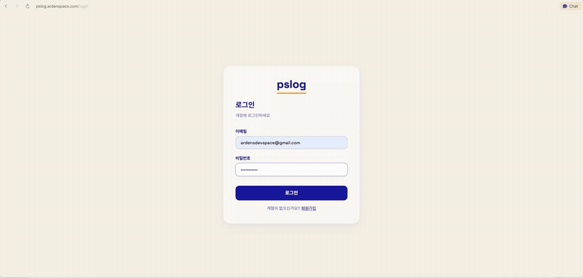

# pslog

개발팀용 태스크 관리·협업 툴. Kanban/Table/Week 뷰 기반 태스크 관리에 더해, 추적 대상 repo의 `PLAN.md`·`handoffs/`·git push webhook·앱 로그를 ingest 해서 **계획↔실제 드리프트 감지, 에러 그룹핑, Discord 알림**까지 제공한다.

**라이브 데모**: [pslog.ardenspace.com](https://pslog.ardenspace.com)



## Claude Code 플러그인 (마켓플레이스)

이 repo는 pslog 앱 외에 **Claude Code 워크플로 플러그인**(`pslog-workflow`)을 마켓플레이스로 배포한다:

```
/plugin marketplace add ardenspace/pslog
/plugin install pslog-workflow@pslog
```

스킬 3개(pslog-planning / pslog-workflow / pslog-refactor)와 SessionStart 훅 구성. v0.3.x부터 구현 step마다 기존 회귀 스위트를 돌리고, 끝 검증에 독립 리뷰어 서브에이전트 + 회귀 테스트 게이트가 포함된다 — 상세는 [`plugins/pslog-workflow/README.md`](plugins/pslog-workflow/README.md).

## 기술 스택

### Backend
- **FastAPI** - Python 웹 프레임워크
- **PostgreSQL** - 데이터베이스 (로컬/운영 모두 Docker)
- **SQLAlchemy** - ORM
- **Alembic** - DB 마이그레이션
- **JWT** - 인증

### Frontend
- **Vite + React** - SPA
- **shadcn/ui + Tailwind** - UI 라이브러리

## 프로젝트 구조

```
pslog/
├── backend/
│   ├── app/
│   │   ├── models/          # DB 모델 — user / workspace / project / task(+comment) /
│   │   │                    #   share_link / task_event / git_push_event / handoff /
│   │   │                    #   drift / log_event / log_ingest_token / error_group /
│   │   │                    #   rate_limit_window
│   │   ├── services/        # 비즈니스 로직 (라우터는 얇게 유지)
│   │   ├── core/            # 핵심 로직
│   │   │   ├── security.py  # JWT, 비밀번호 해싱
│   │   │   ├── crypto.py    # GitHub PAT / webhook secret Fernet 암호화
│   │   │   └── permissions.py
│   │   ├── api/             # API 라우터 (v1/endpoints/)
│   │   ├── schemas/         # Pydantic 스키마
│   │   ├── config.py
│   │   ├── database.py
│   │   ├── dependencies.py
│   │   └── main.py
│   ├── alembic/             # DB 마이그레이션
│   ├── requirements.txt
│   └── .env
├── frontend/
└── docker-compose.yml
```

## 시작하기

`Makefile` 이 dev 환경 setup 자동화. **app-chak 같은 다른 서비스가 8000/5432 점유 중이어도 충돌 없음** — pslog 는 backend 8081 / postgres 5433 default.

### 첫 setup (한 번만)

```bash
make setup
```

이걸로 다음이 한 번에 됨:
- `backend/venv` 생성 + dev deps 설치
- `backend/.env` 자동 생성 (SECRET_KEY / PSLOG_FERNET_KEY 랜덤)
- `frontend/.env.local` 자동 생성 (`VITE_API_URL` 가 backend port 가리킴)
- `pslog-postgres` Docker 컨테이너 5433 에 띄움
- `alembic upgrade head`
- `frontend` deps 설치 (bun)

기존 `.env` 가 있으면 보존 (시크릿 안 덮음).

### 일상 작업

두 터미널 필요:

```bash
# Terminal 1
make backend     # uvicorn http://localhost:8081 (auto reload)

# Terminal 2
make frontend    # vite http://localhost:5173
```

### 그 외

```bash
make migrate     # alembic upgrade head
make test        # backend pytest + frontend build/lint
make db-down     # pslog-postgres 만 stop (app-chak 안 건드림)
make db-up       # 다시 띄움
make clean       # pslog-postgres 컨테이너 삭제 (volume 은 prune 별도)
make help        # 전체 target 목록
```

### 포트 override

```bash
make backend BACKEND_PORT=8000
make db-up PG_PORT=5432
```

### 수동 setup (Makefile 안 쓸 때)

```bash
# 1. PostgreSQL — app-chak 과 충돌 없는 5433 사용 권장
docker run -d --name pslog-postgres \
  -e POSTGRES_USER=pslog -e POSTGRES_PASSWORD=pslog123 -e POSTGRES_DB=pslog \
  -p 5433:5432 postgres:16-alpine

# 2. backend env (template: backend/.env.example)
cp backend/.env.example backend/.env
# SECRET_KEY / PSLOG_FERNET_KEY 채우기

# 3. backend
cd backend
python3.12 -m venv venv && source venv/bin/activate
pip install -r requirements-dev.txt
alembic upgrade head
uvicorn app.main:app --reload --port 8081

# 4. frontend env + dev server
cp frontend/.env.example frontend/.env.local
cd frontend && bun install && bun run dev
```

서버 실행 후:
- API: http://localhost:8081
- API 문서: http://localhost:8081/docs
- Frontend: http://localhost:5173

### Alembic

```bash
# 새 마이그레이션 생성
cd backend && source venv/bin/activate
alembic revision --autogenerate -m "마이그레이션 메시지"

# 적용
alembic upgrade head

# 롤백
alembic downgrade -1
```

## 데이터 모델

### 핵심 엔티티

- **User** - 사용자
- **Workspace** - 워크스페이스 (팀/조직)
- **WorkspaceMember** - 워크스페이스 멤버십 (권한: Owner/Editor/Viewer)
- **Project** - 프로젝트
- **ProjectMember** - 프로젝트 참여자
- **Task** - 태스크 (상태: To do/Doing/Done/Blocked)
- **Comment** - 댓글 (모델만 존재, API/UI 미구현 — DECISIONS.md 참조)
- **ShareLink** - 공유 링크 (외부 공유, 30일 만료 + 수동 철회)
- **TaskEvent** - 활동 로그

### Git 연동 / 정합성

- **GitPushEvent** - GitHub webhook 으로 수신한 push 이벤트
- **Handoff** - `handoffs/{브랜치}.md` 문서의 동기화 상태
- **Drift** - PLAN/handoff/DECISIONS 간 정합성 위반 1건 (open/resolved/ignored)

### 로그 수집

- **LogIngestToken** - 프로젝트별 로그 수집용 API 토큰
- **LogEvent** - 수집된 로그 이벤트 (월별 파티션)
- **ErrorGroup** - 에러 로그를 핑거프린트로 묶은 그룹
- **RateLimitWindow** - ingest rate limit 윈도우

## 환경변수

전체 템플릿: `backend/.env.example`, `frontend/.env.example`. `make setup` 이 자동 생성 (시크릿은 랜덤).

| 변수 | 위치 | 설명 |
|---|---|---|
| `DATABASE_URL` | backend/.env | PostgreSQL async URL (asyncpg driver) |
| `SECRET_KEY` | backend/.env | JWT 서명. `secrets.token_urlsafe(32)` |
| `PSLOG_FERNET_KEY` | backend/.env | Webhook secret / GitHub PAT 암호화. `Fernet.generate_key()` |
| `PSLOG_PUBLIC_URL` | backend/.env | webhook callback URL (GitHub 가 호출). 로컬: `http://localhost:8081` / 운영: Cloudflare Tunnel URL |
| `ALLOWED_ORIGINS` | backend/.env | CORS — frontend origin (default `http://localhost:5173`) |
| `VITE_API_URL` | frontend/.env.local | backend API base URL (default `http://localhost:8081/api/v1`) |

## 배포

운영은 **이 호스트의 docker compose** 로 돌린다 (Railway/Render PaaS 아님 — repo 의 `render.yaml`/`netlify.toml` 은 대안 설정일 뿐 현재 활성 경로가 아님). 외부 노출은 **Cloudflare Tunnel** 이 공개 도메인 → `localhost:8081` 로 매핑 (`PSLOG_PUBLIC_URL`, GitHub webhook 이 이 URL 로 들어옴).

> ⚠️ **자동 배포 아님.** main 에 push 해도 컨테이너는 그대로다 (배포 자동화 없음 — GitHub Actions CI 는 테스트만 돈다). 새 코드를 반영하려면 **이 호스트에서 직접** 아래 명령을 쳐야 한다.

### 백엔드 (docker compose)

```bash
make up        # 최초 기동: postgres + backend 컨테이너 (alembic 자동 적용)
make restart   # 코드 갱신 후 재배포: backend 만 rebuild + 재기동
make logs      # 백엔드 로그 follow
make ps        # 컨테이너 상태
```

- `make restart` = `docker compose up -d --build backend` — **현재 체크아웃된 코드**(`./backend`)로 이미지 재빌드.
- 컨테이너 시작 시 `alembic upgrade head` → uvicorn(:8081) 순으로 자동 실행 (`backend/Dockerfile` CMD). 즉 **마이그레이션은 배포 때 알아서 적용**된다.
- postgres 데이터는 `pslog_pgdata` named volume 에 영속. `make clean` 은 volume 까지 삭제(데이터 소실)이므로 주의.
- 운영 환경변수는 `backend/.env` 가 컨테이너에 그대로 주입된다 (`DATABASE_URL` 만 compose 가 internal network 용으로 override). `PSLOG_FERNET_KEY` 가 비면 부팅 실패하니 반드시 채울 것.

### 프론트엔드 (별도 호스트)

compose 는 backend + postgres 만 띄운다. 프론트는 정적 빌드 후 별도로 서빙한다.

```bash
cd frontend && bun run build   # = tsc -b && vite build → frontend/dist/
```

> ⚠️ **`VITE_API_URL` 은 빌드 시점에 정적으로 박힌다** (Vite). 운영용 빌드 전에 `frontend/.env.local` 의 `VITE_API_URL` 을 **공개 백엔드 URL**(Cloudflare Tunnel 도메인 + `/api/v1`)로 바꿀 것. 로컬 기본값(`http://localhost:8081/api/v1`)으로 빌드하면 로컬에서만 동작한다.

생성된 `frontend/dist/` 를 정적 호스트에 올린다 (`netlify.toml` + `dist/_redirects` 는 Netlify SPA 리다이렉트용 설정).

## 구현 상태 (2026-07 기준)

- [x] 인증 (register/login/me) + Workspace/Project CRUD + 멤버 관리 (Owner/Editor/Viewer)
- [x] Task CRUD + Kanban(드래그앤드롭) / Table / Week 뷰 ("내 태스크만" 필터 포함)
- [x] 공유 링크 — 생성/철회/재활성 API + 관리 UI + 공개 read-only 뷰 (`/share/:token`)
- [x] Discord 요약 리포트
- [x] GitHub 연동 — webhook push 수신, git settings(레포/PAT), PLAN·handoff 동기화, 드리프트 감지 (Drifts 탭)
- [x] 로그 수집 파이프라인 — ingest 토큰 발급, rate limit, 에러 핑거프린트 그룹핑 (Errors 탭), 헬스 체크

남은 작업/우선순위는 `BACKLOG.md` 와 PLAN.md(로컬, pslog-workflow 플러그인이 관리) 참조.

## 문서

- `PRD.md` / `SCOPE.md` — MVP(2026-02) 시점 기준 문서. MVP 이후 확장의 source of truth는 아래 설계서.
- `docs/superpowers/specs/` — 기능별 설계서 (git 연동 automation, error-log 시리즈, Discord 알림, decision-truth loop 등)
- `DECISIONS.md` — 프로젝트 결정 로그 (단일 입구)
